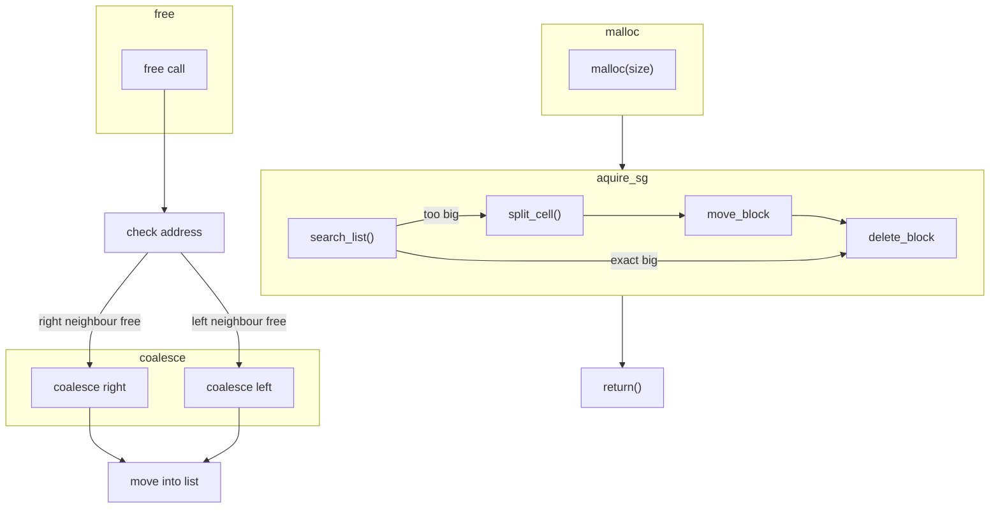

```mermaid

flowchart TD
    subgraph sg_malloc [malloc]
        malloc_node["malloc(size)"]
    end
    return_malloc["return()"]
    subgraph aquire_sg
      search["search_list()"]
      split["split_cell()"]
      move["move_block"]
      delete["delete_block"]
    end
    sg_malloc --> aquire_sg
    search -->|too big| split
    split --> move
    move --> delete
    search -->|exact big| delete
    aquire_sg --> return_malloc
	
	subgraph sg_free [free]
		free_call["free call"]
	end
	subgraph sg_coalesce [coalesce]
		coalesce_r["coalesce right"]
		coalesce_l["coalesce left"]
	end
	check["check address"]
	put["move into list"]
	free_call --> check
	check -->|right neighbour free| coalesce_r
	check -->|left neighbour free| coalesce_l
	coalesce_r --> put
	coalesce_l --> put
	
	
	
    
```
